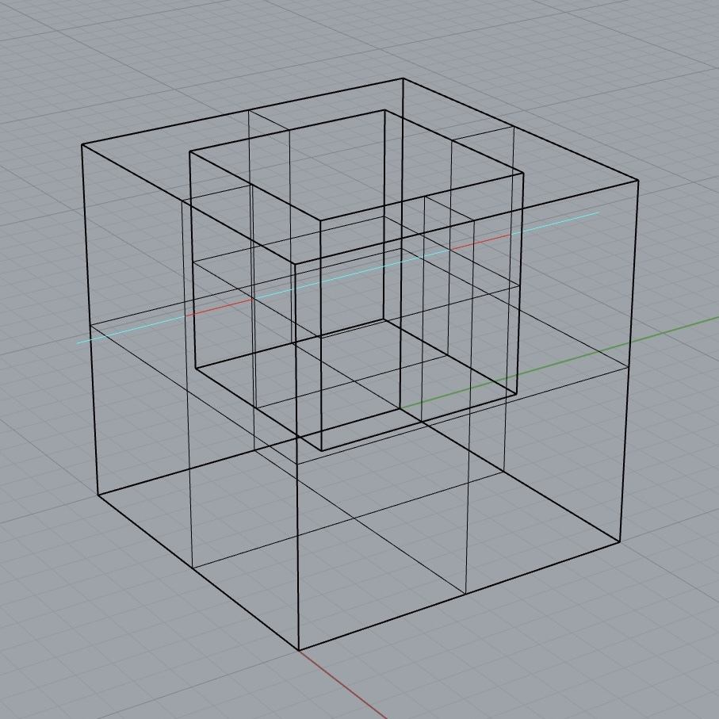
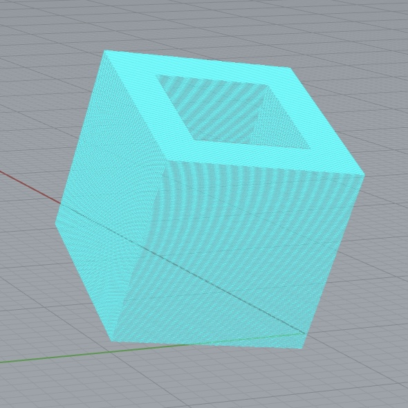

# [Winder](https://github.com/ruancarllo/winder) &middot;  

Winder é um plug-in para a **harmonização dos vetores normais** de sólidos do [Rhinoceros](https://www.rhino3d.com), um software de modelagem tridimensional. Esse processo visa orientar todas as superfícies de um conjunto de objetos selecionados para seu próprio exterior, a fim de prepará-lo para a impressão 3D.

  

Para tanto, são utilizados conceitos e recursos do campo da **Geometria Computacional** como a [boundary representation](https://en.wikipedia.org/wiki/Boundary_representation), a [integral de Riemann](https://en.wikipedia.org/wiki/Riemann_integral) e o [dot product](https://en.wikipedia.org/wiki/Dot_product), além das muitas outras técnicas permitidas pela linguagem [C#](https://dotnet.microsoft.com/en-us/languages/csharp) e pelo [.NET Framework](https://dotnet.microsoft.com/en-us/learn/dotnet/what-is-dotnet-framework) — tudo isso de um modo otimizado dentro das realidades de processamento de um computador.

## Etapas básicas do algoritmo

O funcionamento do comando principal do Winder é baseado nas seguintes etapas, as quais ocorrem de forma interativa devido às múltiplas cores de layers criadas pelo programa durante sua execução:

- Identificação dos objetos selecionados e filtragem daqueles que podem ser representados como boundaries;
- Definição de parâmetros globais como o centro e o tamanho da diagonal da caixa delimitadora desses objetos;
- Integração dos boundary objects, utilizando o método da intersecção de raios, para encontrar seus centróides;
- Decisão da direção de cada superfície explodida a partir de operações vetoriais como dot product, soma e subtração.

## Traçando raios para encontrar o interior

Sem sombras de dúvidas, o método mais importante para o funcionamento deste algoritmo é o traçamento de **raios secantes** a determinados pontos dos boundary objects, com a finalidade de encontrar as regiões internas dessa figura. Isso pode ser feito considerando que, caso a quantidade de pontos que o raio intercepta com os objetos unidos seja par, ocorre uma alternância entre regiões externas e internas, visto que o comprimento desse raio é, por definição, o dobro do tamanho da maior diagonal da caixa delimitadora que representa o conjunto de todos os objetos analisados.

  
  

Sendo assim, caso esse raio secante esteja interceptando, perpendicularmente, um ponto do qual sai um vetor normal de alguma superfície, ao ser identificada sua região externa mais próxima, é possível calcular o **dot product** ($d$) entre o vetor normal original $\vec{N} = [x, y, z]$, e o vetor normal $\vec{N'} = [x', y', z']$ voltado para região externa. Suas dimensões cartesianas são representadas, respectivamente, por valores de $n$ e $n'$.

$$
\begin{align*}
d &= \vec{N} \cdot \vec{N'} \\
d &= \sum_{i=1}^{3} n_i \times n'_i \\
d &= x \times x' + y \times y' + z \times z'
\end{align*}
$$

Consequentemente, a análise do sinal de $d$ desencadeia três possíveis ações:

- $d > 0$: Os vetores $\vec{N}$ e $\vec{N'}$ apontam para o mesmo lado.
- $d < 0$: Os vetores $\vec{N}$ e $\vec{N'}$ apontam para lados opostos.
- $d = 0$: Os vetores $\vec{N}$ e $\vec{N'}$ são perpendiculares (90°).

## Integrando para mudar os centróides

Com certeza, a análise de objetos com pequenas aberturas e superfícies sobrepostas é uma tarefa muito complexa, que pode gerar inúmeras incoerências geométricas — sobretudo nos casos em que o raio secante intercepte um número ímpar de objetos, ou que o dot product seja igual a zero.

Nesse contexto, é usada a ideia da **integral de Riemann** para definir os pontos médios de cada partição do sólido, calculada a partir das densidades $d_x$ e $d_z$, as quais representam a quantidade de **raios de integração** paralelos, respectivamente, aos eixos $x$ e $z$, que vão seccionando a figura. Além disso, considera-se uma **caixa delimitadora margeada** do conjunto de objetos analisados, que possui um ponto mínimo $B_0$ e um ponto máximo $B$.

Sendo assim, as distâncias $S_x$ e $S_z$ entre os raios de intgração nos eixos $x$ e $z$ são calculadas por:

$$
\begin{align*}
S_x &= \frac{B_x - B_0x}{d_x + 1} \\
S_z &= \frac{B_z - B_0z}{d_z + 1}
\end{align*}
$$

Ademais, craio de integração possuem um ponto de início $I_0$ e um ponto de término $I$, os quais são definidos pela seguinte relação:

$$
\begin{align*}
\sum I_0 &= \sum_{i_x=1}^{d_x} \sum_{i_z=1}^{d_z} \begin{bmatrix} B_0x + S_x \times i_x \\ B_0y \\ B_0z + S_z \times i_z \end{bmatrix} \\
\sum I &= \sum_{i_x=1}^{d_x} \sum_{i_z=1}^{d_z} \begin{bmatrix} B_0x + S_x \times i_x \\ B_y \\ B_0z + S_z \times i_z \end{bmatrix}
\end{align*}
$$

Assim, ao ser tomada uma superfície cujos cálculos apresentaram resultados incoerentes, a direção de seu vetor normal é orientada para a região mais distante em relação ao ponto médio da integral mais próximo da origem desse vetor.